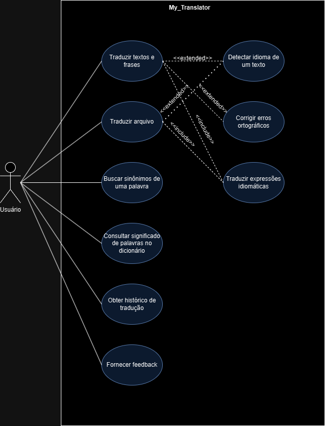
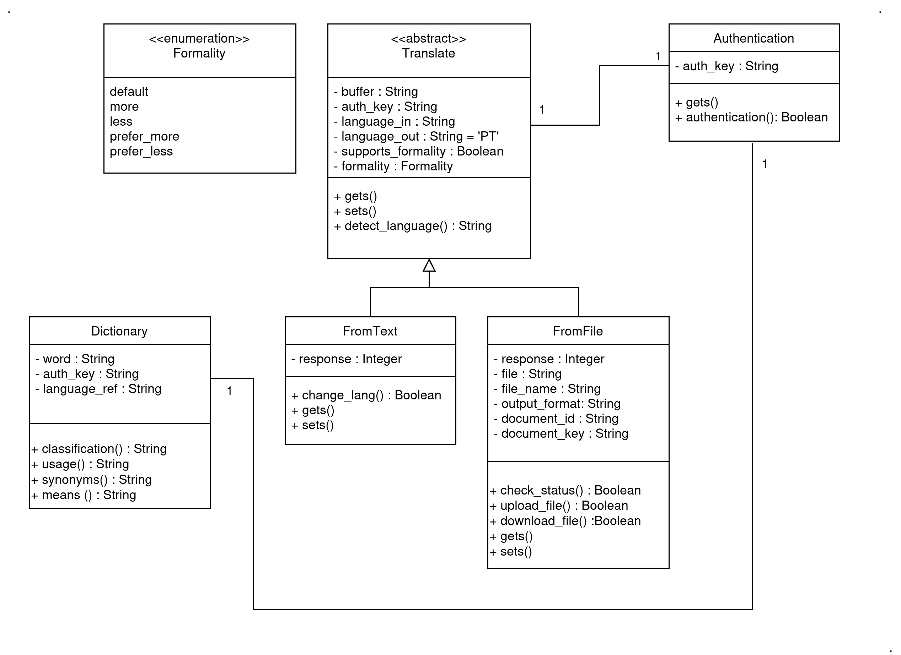
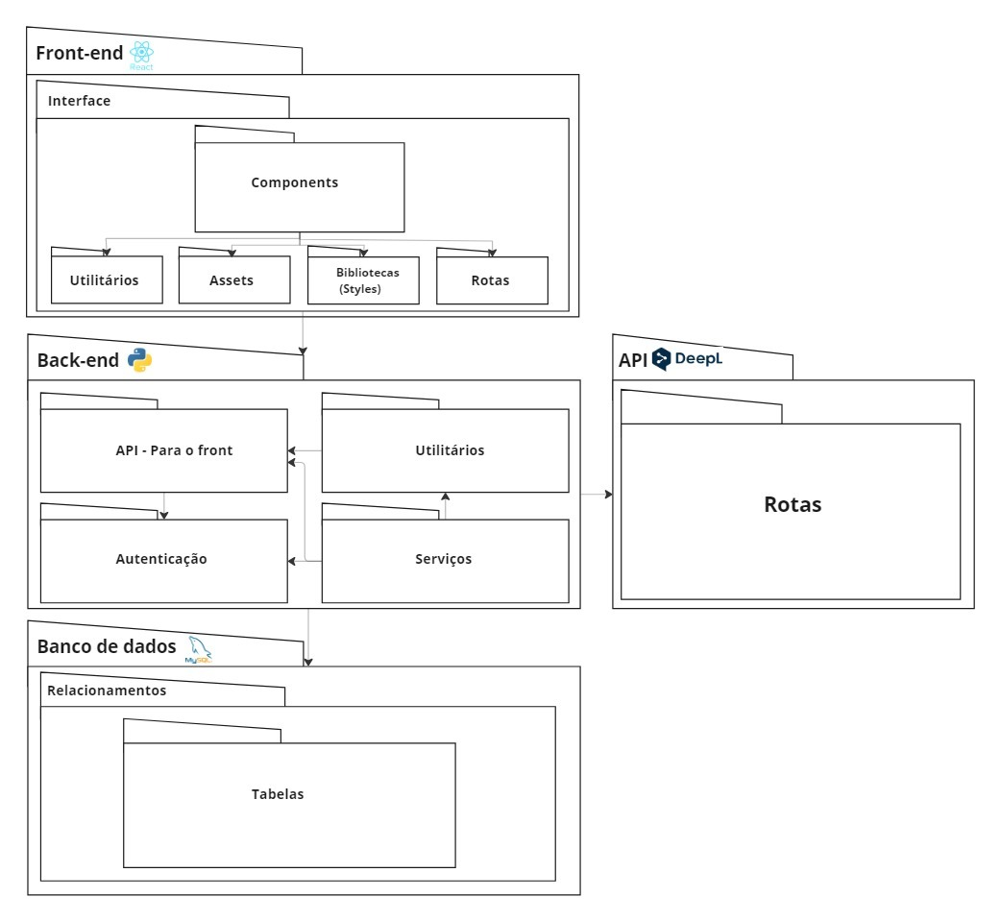
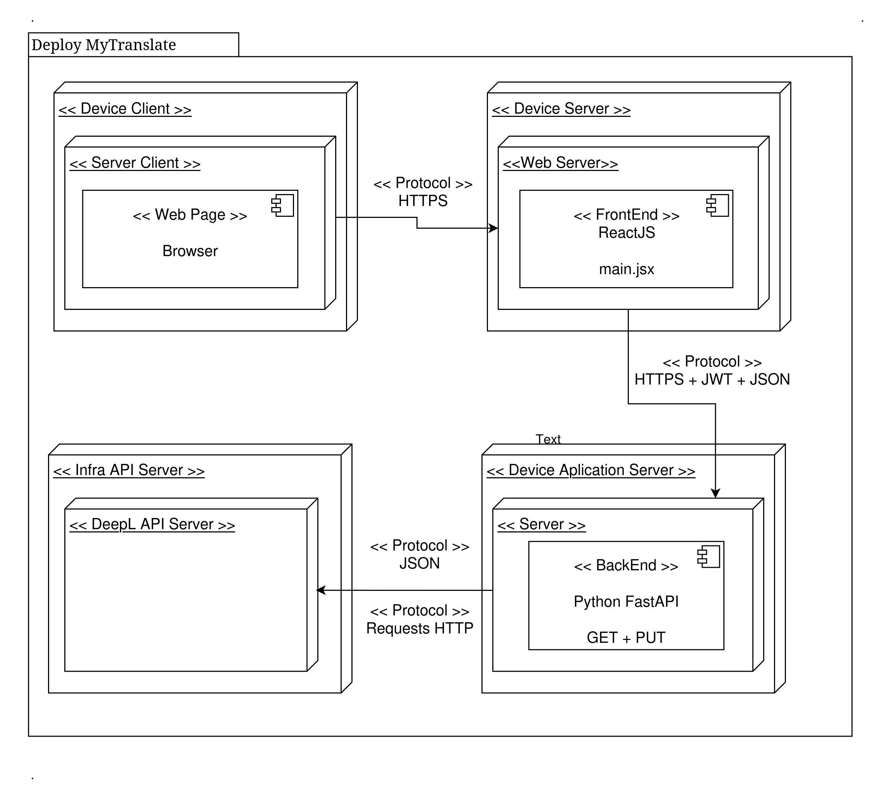
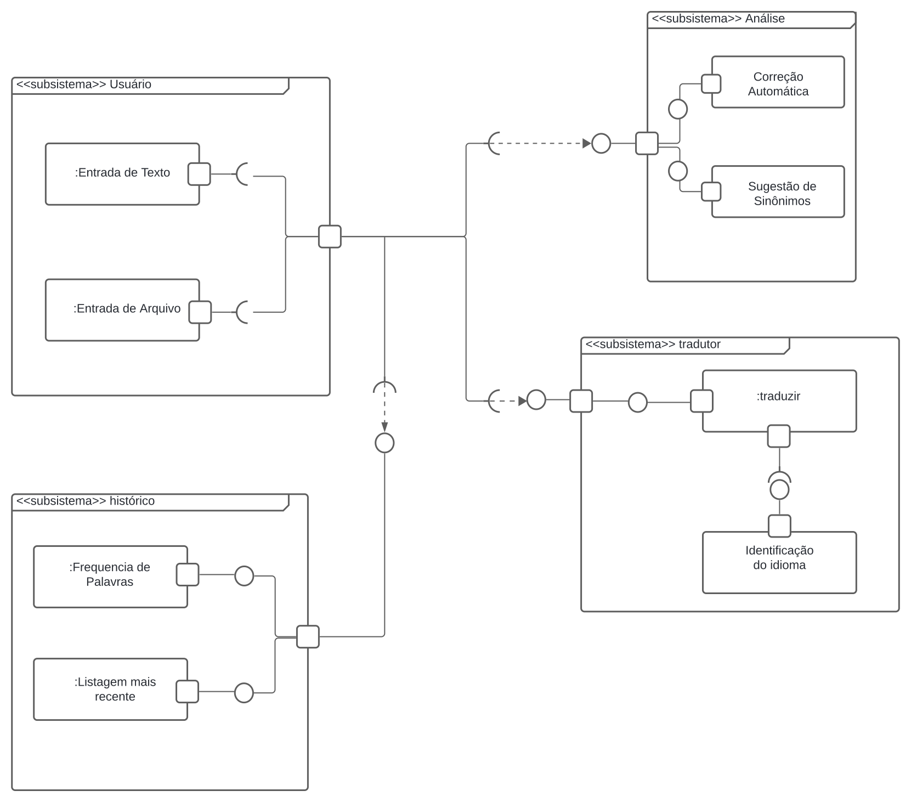

# Módulo Estilos e Padrões Arquiteturais

## 1.0 Introdução

O Documento de Arquitetura de Software (DAS) é uma peça fundamental no processo de desenvolvimento de sistemas, pois descreve de forma detalhada a estrutura, os componentes principais e as interações do software. Ele serve como um guia para a equipe de desenvolvimento, garantindo que todos os envolvidos tenham uma compreensão clara e unificada da arquitetura proposta. O DAS facilita a comunicação entre as partes interessadas, documenta decisões críticas e assegura que o sistema seja construído de maneira consistente e alinhada com os objetivos técnicos e de negócios.

### 1.1 Escopo

O artefato em questão de Documento de Arquitetura de Software, visa documentar o fluxo de uma aplicação de tradução e dicionário de palavras em linguagem natural.

### 1.2 Definições, Acrônimos e Abreviações

| Acrônimos/Abreviações | Definição |
|-----------------------|-----------|
| GoF                   | Gang of four (GoF) refere-se a um compilado de padrão de projeto que orienta o desenvolvimento de software voltado à orientação a objetos. |
| GRASP                 | Padrões de Software para Atribuição de Responsabilidade Geral (GRASP), um padrão de projeto que subdividem de maneira a otimizar a atribuição de responsabilidade a nível de código no projeto. |
| MVC                   | Model View Controller (MVC) trata-se de um padrão de design de software que subdivide ele em três camadas modularizadas. |
| BackEnd               | Diz respeito à implementação dos requisitos não funcionais e regras de negócio. |
| FrontEnd              | Diz respeito à implementação de requisitos funcionais e interface gráfica com o usuário. |

### 1.3 Visão Geral

Realizando um panorama acerca do projeto, apresentando um diagrama de classes, pacotes e analisando os padrões de arquitetura propostos GRASP e GoF, temos um modelo construído em cima de um design MVC.

#### 1.3.1 View

A camada de view do design MVC é responsável pela visualização do sistema, realizada pelo usuário final do projeto, a interface com usuário, por sua vez representa a cama de mais alto nível, interagindo com a camada de controle, que gerencia o projeto. O diagrama de pacotes que representa a camada de view pode ser visto na Figura 3: [Diagrama de Pacotes](#52-diagrama-de-pacotes).

#### 1.3.2 Controller

A camada controller é responsável por gerenciar o sistema, ela recebe os dados fornecidos pelo usuario na camada superior e gerencia os dados conversando com a camada mais inferior do sistema, a model. O entendimento detalhado da camada de controle, pode ser realizado consultando o artefato de padrão de arquitetura, [GRASP controller](https://unbarqdsw2024-1.github.io/2024.1_G9_My_Translator/#/PadroesDeProjeto/3.PadroesDeProjeto.md), além de compreender também através do pacote BackEnd em Figura 3: [Diagrama de Pacotes](#52-diagrama-de-pacotes).

#### 1.3.3 Model

A model pode ser representada pela Figura 1: [Diagrama de Classes](#51-diagrama-de-classes), ela traz as principais funcionalidade em classes a nível de diagramação do que deve ser implementado.

## 2.0 Representação Arquitetural

A arquitetura do projeto foi idealizada em cima das principais literaturas e padrões de mercado, nela é possível construir um sistema robusto e escalável, para o projeto em questão levou-se em consideração os padrões estruturais propostos no GoF e GRASP.
Padrões estes sendo o **Factory Method**, **Facade**, **Chain of Responsibility** e **Controller**.

### 2.1 GoFs

O GoF compõe uma série de padrões em diferentes níveis de implementação e abstração, seu objetivo principal é garantir uma maior manutenção e escalabilidade de software, são subdivididos em três principais, GoFs criacionais, estruturais e comportamentais.

#### 2.1.1 Criacional

Os padrões de projeto com foco em criacional, tem como objetivo estabelecer a maneira em que os objetos no sistema são criados, desta forma garantindo uma independência entre a maneira da criação dos objetos e o sistema. O padrão desenvolvido no projeto foi o **Factory method**. A melhor compreensão do funcionamento deste padrão tanto a nível teórico, quanto a nível de implementação, pode ser obtida consultando o artefato [GoF Criacional](https://unbarqdsw2024-1.github.io/2024.1_G9_My_Translator/#/PadroesDeProjeto/3.1.GoFsCriacionais.md).

#### 2.1.2 Estrutural

Os padrões referente ao estrutural visão realizam uma composição de métodos e classes de maneira flexível, escalável e de fácil manutenção, por meio de reuso de código e encapsulamento de subestruturas complexas. O padrão designado para cumprir esse papel foi o **Facade**. Uma melhor compreensão técnica e prática de implementação por ser adquirida consultando o artefato [GoF Estrutural](https://unbarqdsw2024-1.github.io/2024.1_G9_My_Translator/#/PadroesDeProjeto/3.2.GoFsEstruturais.md).

#### 2.1.3 Comportamental

Padrões pertencentes ao comportamental, tem metas de evitar a dependência entre objetos denecessariamente, deste modo é possível adquirir uma maior reutilização e menor complexidade em sua manutenção. O padrão selecionado para este trabalho foi o **Chain of Responsibility**, mais detalhes a respeito do padrão para fins didáticos e  de compreensão pode ser realizado por meio do acesso ao artefato [GoF comportamental](https://unbarqdsw2024-1.github.io/2024.1_G9_My_Translator/#/PadroesDeProjeto/3.3.GoFComportamentalChainOfResponsibility.md)

### 2.2 GRASP

O GRASP diz respeito a uma série de diretrizes que foram desenvolvidas para ajudar na atribuição de responsabilidades a classes e objetos em projetos de software orientado a objetos, desta forma fornecendo uma estrutura sistemática e organizacional, facilitando o encapsulamento da lógica do projeto de maneira adequada.

#### 2.2.1 Controller

O **GRASP controller** apresenta uma maneira de gerenciar e coordenar a interação direta do usuário com o sistema. No projeto em questão ele atua como  a camada controller do design MVC, orquestrando a interação da camada view com a model. Para melhor compreensão do GRASP controller, consultar artefato [GRASP controller](https://unbarqdsw2024-1.github.io/2024.1_G9_My_Translator/#/PadroesDeProjeto/3.PadroesDeProjeto.md).

## 3.0 Objetivos e restrições arquiteturais

O objetivo da aplicação é fornecer um sistema que se possa realizar a tradução entre linguagens naturais. Sobretudo o projeto apresenta algumas limitações estabelecidas pelo escopo e requisitos trabalhados.

| Limitações |
|------------|
| Apresenta limite de dados estabelecido pela API utilizada, DeepL. A API do DeepL fornece um plano gratuito que restringe a um número pequeno de traduções para uma aplicação comercial. |
| O projeto se limita a execuções em ambiente controlado, não sendo realizado o deploy da aplicação em meio de produção. |
| O fato da ausência do deploy da aplicação não permite calcular o desempenho e realizar testes de stress da aplicação via múltiplas requisições de acesso. |
| A versão desenvolvida não conta com a funcionalidade de escuta de textos traduzidos na língua que se deseja traduzir. | 
| A aplicação não conta com algumas funcionalidades de acessibilidade, principalmente visual, pois não oferece a escuta de textos escritos ou traduzidos. | 
| O MyTranslator não apresenta funcionalidade de histórico de tradução realizadas anteriormente. |
| O projeto não possui docker para facilitar na sua execução. |

## 4.0 Casos de Uso

Visões de casos de uso são representações visuais ou textuais que descrevem como os usuários (atores) interagem com um sistema para alcançar um objetivo específico. Elas ajudam a capturar os requisitos funcionais do sistema ao ilustrar as principais funcionalidades e o fluxo de interações entre os usuários e o sistema. Através de diagramas e descrições detalhadas, as visões de casos de uso permitem uma melhor compreensão das necessidades dos usuários, facilitando a comunicação entre desenvolvedores, stakeholders e equipes de design, além de servir como base para a implementação e teste do sistema.

Casos Elicitados:

| ID  | Descrição do Caso de Uso             |
| --- | ------------------------------------ |
| UC1 | Traduzir textos e frases.            |
| UC2 | Traduzir Arquivos.                   |
| UC3 | Buscar sinonimo de uma palavra.      |
| UC4 | Consultar significados das palavras. |
| UC5 | Obter Historico de Tradução.         |
| UC6 | Fornecer Feedback.                   |
| UC7 | Detectar Idioma.                     |
| UC8 | Corrigir Erros Ortograficos.         |
| UC9 | Traduzir Expressões Idiomaticas.     |

Figura 1: Diagrama de Casos de Uso. Autores: Daniel Oda, Pedro Torreão, 2024.

## 5.0 Visão lógica
A visão lógica na arquitetura de software refere-se a uma parte do conjunto que inclui Classes e Pacotes. Essa visão é uma abstração dos modelos criados, destacando suas principais características e simplificando suas representações. A modelagem do diagrama de classes e do diagrama de pacotes permite uma análise mais detalhada das principais camadas arquiteturais desenvolvidas no projeto. Além disso, para uma perspectiva ainda mais abstrata, utilizam-se o diagrama de atividades. A seguir, é apresentado os diagramas desenvolvidos e como relacionam-se entre si. 

### 5.1 Diagrama de Classes
O diagrama de classes oferece uma representação visual das classes que formam um sistema, assim como os relacionamentos entre elas. Através desse diagrama, é possível entender o comportamento do sistema, identificar as responsabilidades na criação de instâncias, definir a visibilidade de atributos e métodos, além de visualizar relacionamentos como composição, agregação, entre outros.
O diagrama de classes abaixo demonstra as requisições feitas a API do Deepl por meio da classe Translate.

Figura 2: Diagrama de Classes. Autores: Francisco Mizael, Daniel Oda, 2024.

### 5.2 Diagrama de Pacotes
O diagrama de pacotes organiza e agrupa elementos de um sistema em pacotes, mostrando as dependências e relações entre eles. Ele ajuda a visualizar a estrutura modular do sistema, representando como as classes e outros componentes são agrupados e interagem em um nível mais alto de abstração. Esse diagrama é útil para organizar e gerenciar a complexidade do software, facilitando o entendimento da arquitetura e a manutenção do sistema.

Figura 3: Diagrama de Pacotes. Autores: Pedro Campos, 2024.

## 6.0 Visão de Processos

A visão de processos na arquitetura de sistemas de software oferece uma compreensão detalhada de como os processos e tarefas são organizados, estruturados e interagem entre si. Essa perspectiva é essencial para identificar e mapear os processos-chave do sistema, permitindo a compreensão de sua comunicação, coordenação, sincronização e compartilhamento de recursos, sendo vital para modelar a interação entre componentes, módulos e serviços, direcionando-os para o cumprimento dos objetivos globais do sistema.
Essa abordagem permite um mapeamento preciso das entradas, saídas e fluxos de informação no software, delineando claramente as responsabilidades e interações de cada componente, exercendo um papel crucial na análise de desempenho, na identificação de gargalos, na otimização do fluxo de trabalho e na verificação de conformidade com os requisitos funcionais e não funcionais.
Além disso, essa análise detalhada promove a eficiência operacional, a escalabilidade e a facilidade de manutenção do software, permitindo uma melhor alocação de recursos e facilitando a adaptação da arquitetura às mudanças nas necessidades do negócio. Com isso, a visão de processos não apenas fortalece a robustez e a resiliência do sistema, mas também assegura que ele possa evoluir de forma contínua.
Partindo desse conceito, podemos encaixar os diagramas de:
- [Artefato do Diagrama de atividades](https://unbarqdsw2024-1.github.io/2024.1_G9_My_Translator/#/Modelagem/Dinamicos/1.1.DiagramaDeAtividades), ele consegue nos fornecer uma visão do "todo", premitindo que realizemos a análise do fluxo por completo, tanto da parte de usuário como a parte do sistema de tradução.
- [Artefato do Diagrama de comunicação](https://unbarqdsw2024-1.github.io/2024.1_G9_My_Translator/#/Modelagem/Dinamicos/1.2.DiagramaDeComunicação), Esse artefato consegue descrever os fluxos de informação e as interações entre as diferentes entidades do sistema.

## 7.0 Visão de Implantação

A versão de implantação apresentada, trata-se de um protótipo de baixa fidelidade e idealizado funcionamento do deploy da aplicação, a primeira versão desenvolvida apresenta apenas os módulos desenvolvidos.

### 7.1 Elementos implantados

#### Device Client 
Dispositivo cliente, este trata-se do dispositivo que o usuário final faz uso, nele é possível identificar que ele acessa a aplicação via Web Browser. Dispositivo este que se comunica com o **Device Server via protocolo HTTPS**

#### Device Server
Dispositivo do servidor web, neste dispositivo se destaca por executar a aplicação FrontEnd em ReactJS, Aplicação esta que por sua vez se comunica com o **Device Application Server**, ou seja o dispositivo responsável por gerenciar o BackEnd do projeto. Também realiza a comunicação via **HTTPS**, além de **JWT** para autenticação e **JSON** para troca de dados.

#### Device Application Server
Dispositivo servidor que executa o BackEnd, escrito na linguagem python por meio do framework FantAPI, da aplicação, este dispositivo se caracteriza por realizar as regras de negócio referente a aplicação e se comunica diretamente com o servidor da API do DeepL via requisições **HTTP** e **JSON**.

#### Infra API Server
Abstração da infraestrutura responsavel por fornecer a API do DeepL.

### Diagrama de Implantação

Figura 4: Diagrama de implantação. Autores: Francisco Mizael, 2024.

## 8.0 Visão de Implementação

### 8.1 Diagrama de Componentes
O diagrama de componentes ilustra a estrutura física de um sistema de software, destacando os componentes que o compõem e suas interações. Ele representa módulos de software, como bibliotecas, arquivos executáveis, e outros elementos que fazem parte do sistema, e mostra como esses componentes se conectam através de interfaces ou dependências.

Esse diagrama é particularmente útil para visualizar e planejar a arquitetura de implementação, ajudando a garantir que os componentes do sistema sejam organizados de maneira eficiente, com responsabilidades claramente definidas e interações bem delineadas. Em essência, o diagrama de componentes foca em como o sistema é fisicamente montado e como suas partes se relacionam para formar uma solução funcional.

## 9.0 Tamanho e Desempenho

O projeto desenvolvido em relação ao nível de código se mostrou mediano. No estado atual de desenvolvimento, por conta de não ter sido relacionado o deploy, se torna dificil ter um parâmetro do desempenho dele a nivel de requisições e testes de stress, no entanto a aplicação se mostra bem responsiva em ambiente controlado de desenvolvimento.

## 10.0 Qualidade
O fato do sistema ser modular e permitir que novos componentes sejam adicionados sem afetar o funcionamento atual, faz com que a dimensão de escalabilidade seja atendida. O projeto tem a capacidade de aumentar o número de usuários simultâneos sem degradação perceptível do desempenho.
É possível ser executado em diferentes sistemas operacionais, e conforme pré estabelecido no [documento](../Base/1.1.AbordagemNaoEspecifica.md), pode ser usado em dispositivos móveis 

## Referências

> **Arquitetura e Desenho de Software - Aula DAS**. Material de apoio em slides. Milene Serrano.
> **Use-case diagrams - IBM**. Disponível em: https://www.ibm.com/docs/en/rational-soft-arch/9.6.1?topic=diagrams-use-case. Acesso em 08/08/2024.

## Histórico de Versão

| Versão |   Data   |                   Alteração                   |                                          Participantes                                           |
|:------:|:--------:|:---------------------------------------------:|:------------------------------------------------------------------------------------------------:|
|  1.0   | 07/08/24 | Estruturando template e adicionando diagramas |                       [Jefferson Sena](https://github.com/JeffersonSenaa/)                       |
|  1.1   | 08/08/24 |       Criando diagrama de casos de uso        | [Daniel Oda](https://github.com/danieloda/), [Pedro Torreão](https://github.com/PedroTorreao21/) |
|  1.2   | 08/08/24 |     Adicionando descrições dos diagramas      |                       [Jefferson Sena](https://github.com/JeffersonSenaa/)                       |
|  1.3   | 09/08/24 |        Adicionando visão de processos         |                         [Pedro Campos](https://github.com/pedrocampos0/)                         |
|  1.4   | 12/08/24 |     Corrigindo a visão de implementação       |                         [Pedro Eduardo](https://github.com/PedroEduardoSS/)                         |
|  1.5   | 15/08/24 |     Adicionado visão geral, arquitetural e  limitação do projeto       |                         [Francisco Mizael](https://github.com/frmiza/)                         |
|  1.6   | 15/08/24 |     Adicionado tamanho e desempenho e arrumado links       |                         [Francisco Mizael](https://github.com/frmiza/)                         |

