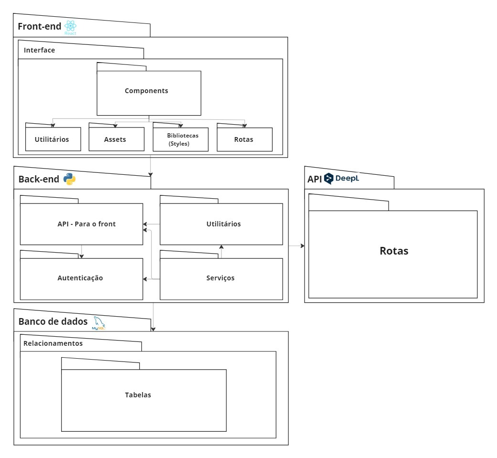

# Módulo Estilos e Padrões Arquiteturais

## 1.0 Introdução

### 1.1 Propósito

### 1.2 Escopo

### 1.3 Definições, Acrônimos e Abreviações

### 1.4 Referências

### 1.5 Visão Geral

## 2.0 Representação Arquitetural

## 3.0 Objetivos e restrições arquiteturais

## 4.0 Casos de Uso

## 5.0 Visão lógica

### 5.1 Diagrama de Classes

### 5.2 Diagrama de Pacotes

## 6.0 Visão de Processos

## 7.0 Visão de Implantação

## 8.0 Visão de Implementação

## 9.0 Tamanho e Desempenho

### 9.1 Diagrama de Componentes

## 10.0 Qualidade

## Histórico de Versão

| Versão |   Data   |                           Alteração                           |                                        Participantes                                         |
| :----: | :------: |:-------------------------------------------------------------:|:--------------------------------------------------------------------------------------------:|
|  1.0   | 07/08/24 |                     Estruturando template e adicionando diagramas                    |                     [Jefferson Sena](https://github.com/JeffersonSenaa/) |

