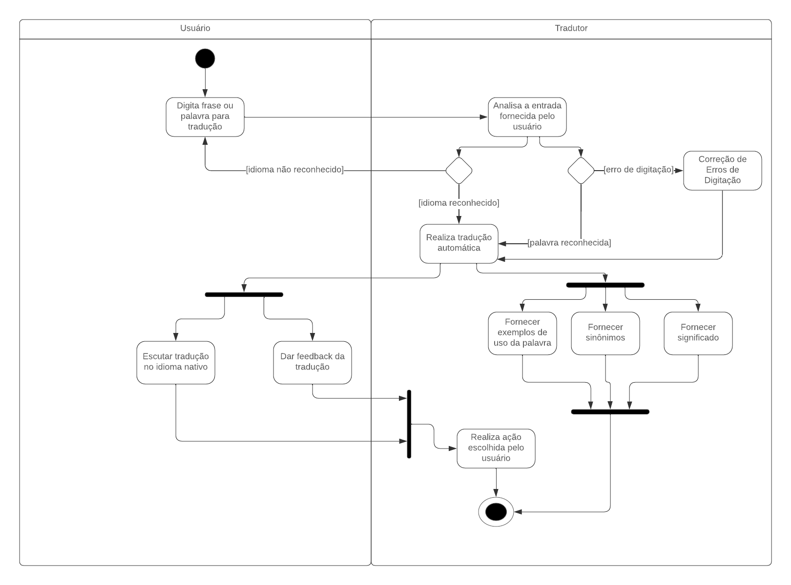

# Diagrama de Atividades

## 1. Introdução

 Um diagrama de atividades é um dos diagramas da UML (Unified Modeling Language) utilizado para modelar o fluxo de trabalho ou atividades em um sistema. Ele descreve o comportamento dinâmico do sistema ao mostrar a sequência de atividades e o fluxo de controle entre elas. Este tipo de diagrama é especialmente útil para representar processos de negócios e fluxos de trabalho complexos, permitindo uma análise detalhada de como as atividades são executadas e como se inter-relacionam.

## 2. Metodologia
Para a criação deste artefato, foi realizada uma análise detalhada do escopo do projeto, do diagrama de classes e, principalmente, dos requisitos elicitados e priorizados ao longo do projeto. Utilizou-se o Lucidchart para a criação do diagrama de atividades, uma ferramenta de design e desenho colaborativa que pode ser compartilhada entre várias pessoas.

## Resultado

## 3. Apresentação

<iframe width="700" height="500" src="https://www.youtube.com/embed/6ujP9bLBBks" title="Diagrama de atividades" frameborder="0" allow="accelerometer; autoplay; clipboard-write; encrypted-media; gyroscope; picture-in-picture; web-share" referrerpolicy="strict-origin-when-cross-origin" allowfullscreen></iframe>

## 4. Participantes

- [Jefferson Sena](https://github.com/JeffersonSenaa)
- [Tiago Albuquerque](https://github.com/Tiago1604)
- [Juan Pablo](https://github.com/Juan-Ricarte)
- [Gabriel Barbosa](https://github.com/Gabrie1Barbosa)

## 5. Referências

> [1] Documentação UML Activity Diagrams Overview, disponível em https://www.uml-diagrams.org/activity-diagrams.html . Acesso em 8 de Julho de 2024
> [2] LucidChart - Diagrama de Atividades, disponível em https://www.lucidchart.com/pages/pt/o-que-e-diagrama-de-atividades-uml . Acesso em 8 de Julho de 2024

## 6. Histórico de versionamento

| Data      | Versão | Descrição           | Autor(es)| Revisores |
|-----------| -- |---------------------| -- |-----------|
| 8/07/2024 |1.0| Criação do artefato | [Gabriel](https://github.com/Gabrie1Barbosa), [Juan Pablo](https://github.com/Juan-Ricarte) | Gabriel |
| 8/07/2024 |1.1| Revisão do artefato | [Daniel Oda](https://github.com/danieloda) | Pedro Campos, Jefferson, Tiago |
