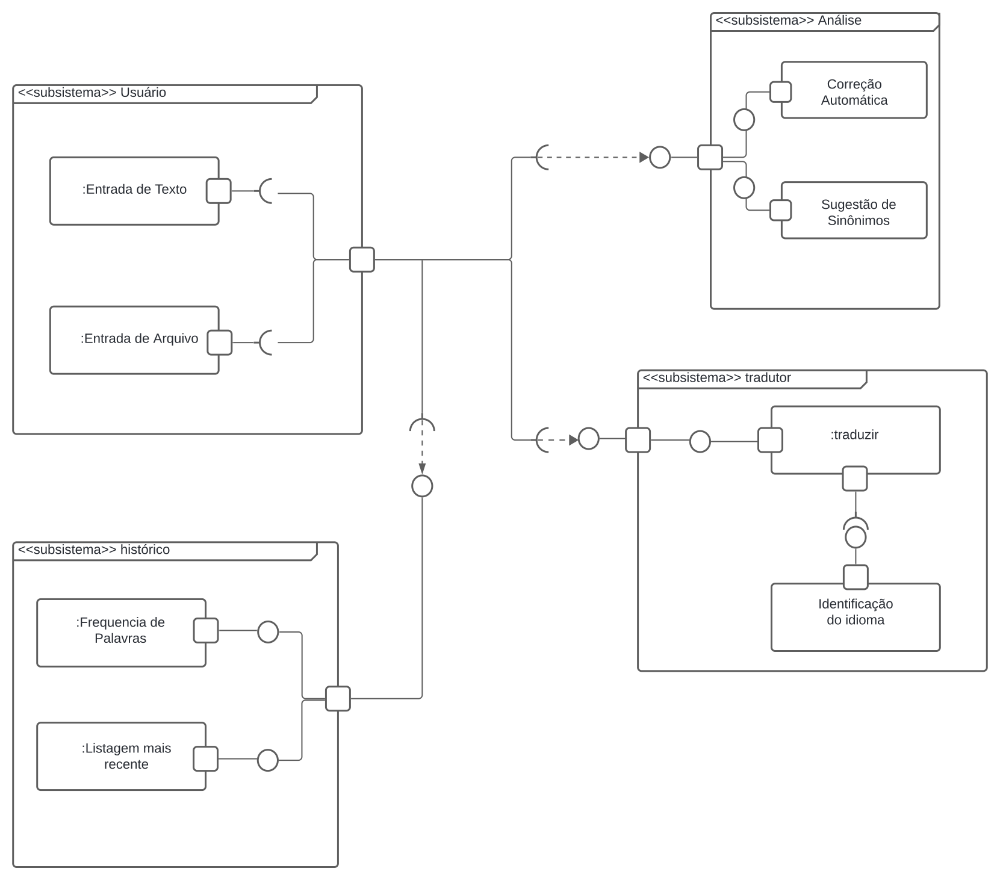

# Diagrama de Componentes

## Introdução

 Um diagrama de componentes é uma técnica que destaca como diferentes partes do sistema estão organizadas e interagem entre si. Componentes, são unidades modulares que encapsulam conteúdo e definem um conjunto de interfaces para interagir com outros componentes. Eles fazem parte dos diagramas estáticos utilizados na Unified Modeling Language (UML) para descrever a organização e a interdependência dos componentes físicos de um sistema.

## Metodologia
Para a elaboração deste artefato, foi realizada uma análise minuciosa do escopo do projeto, permitindo identificar claramente as tecnologias a serem empregadas e as funcionalidades principais que o software deve possuir. Este processo incluiu a consideração detalhada dos requisitos elicitados e priorizados, utilizando técnicas eficazes como MoSCoW e mapa mental.

A técnica MoSCoW, que categoriza os requisitos em "Must Have" (deve ter), "Should Have" (deveria ter), "Could Have" (poderia ter) e "Won't Have" (não terá), foi essencial para garantir que as funcionalidades críticas fossem priorizadas, assegurando que o software atenda às necessidades fundamentais dos usuários finais. Paralelamente, o uso de mapas mentais facilitou a visualização das interrelações entre os diferentes componentes e funcionalidades do sistema, proporcionando uma compreensão holística do projeto.

Adicionalmente, o diagrama de classes serviu como uma base sólida para a modelagem do software, delineando claramente as relações entre os diversos objetos e suas interações. Este diagrama foi criado com o auxílio do Lucidchart, uma ferramenta de design e desenho colaborativa que permite o compartilhamento e edição entre múltiplos usuários. A escolha do Lucidchart se deve à sua interface intuitiva e à capacidade de facilitar a comunicação visual entre os membros da equipe, promovendo um ambiente de trabalho mais coeso e eficiente.

Essa abordagem estruturada e colaborativa garantiu que todos os aspectos do projeto fossem considerados e integrados de forma coerente, resultando em um artefato que reflete com precisão os objetivos do projeto e as expectativas dos stakeholders.

## Diagrama de Componentes

## Apresentação
<iframe width="560" height="720" src="https://www.youtube.com/embed/0Kw3GQdzhds?si=VOX3gEI1DHap8Agl" title="YouTube video player" frameborder="0" allow="accelerometer; autoplay; clipboard-write; encrypted-media; gyroscope; picture-in-picture; web-share" referrerpolicy="strict-origin-when-cross-origin" allowfullscreen></iframe>

## 4. Participantes

- [Jefferson Sena](https://github.com/JeffersonSenaa)
- [Tiago Albuquerque](https://github.com/Tiago1604)
- [Juan Pablo](https://github.com/Juan-Ricarte)
- [Gabriel Barbosa](https://github.com/Gabrie1Barbosa)

## 5. Referências

Documentação UML Package Diagrams Overview, disponível em https://www.uml-diagrams.org/package-diagrams-overview.html. Acesso em 8 de Julho de 2024

[Link de Visualização do Diagrama de Componentes no LucidChart](https://lucid.app/lucidchart/a4e50693-d1e1-4542-8c46-79c22c4b2af9/edit?viewport_loc=578%2C71%2C2296%2C1075%2C0_0&invitationId=inv_beb47104-c9d6-412d-8ab4-fc7cd01e0363) 

## 6. Histórico de versionamento

| Data      | Versão | Descrição           | Autor(es)| Revisores |
|-----------| -- |---------------------| -- |-----------|
| 8/07/2024 |1.0| Criação do artefato | [Jefferson Sena](https://github.com/JeffersonSenaa)| Tiago |
| 8/07/2024 |1.1| Adição do Vídeo | [Jefferson Sena](https://github.com/JeffersonSenaa) e [Tiago Albuquerque](https://github.com/Tiago1604) | Juan Pablo |