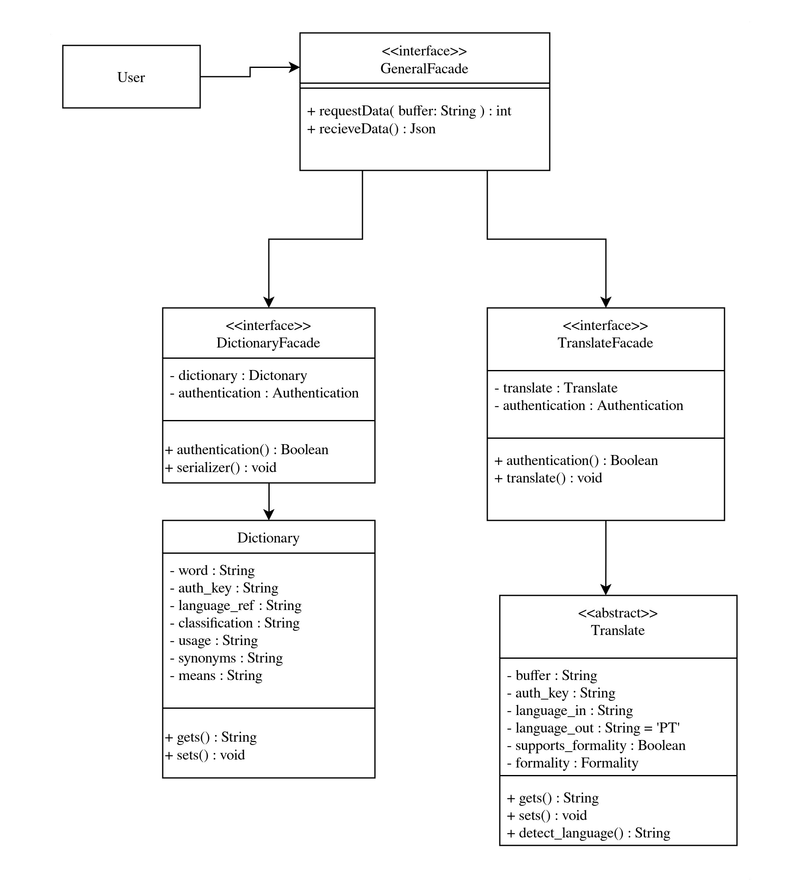

# 3.2. Módulo Padrões de Projeto GoFs Estruturais

## Introdução
O padrão estrutural, juntamente aos padrões criacionais e comportamentais, contemplam boa parte dos padrões de projeto conhecidos na comunidade de engenharia de software. O padrão estrutural em específico tem como objetivo realizar a composição de objetos ou classes de maneira a manter a estrutura mais flexível, estrutura essa que visa maior reuso de código, simplificar subsistemas complexos por meio de uma interface, entre outros objetivos determinados por cada padrão de projeto que contempla o padrão estrutural.

## Metodologia
Para a escolha do padrão de projeto abordado no padrão estrutural, foi realizada uma reunião em equipe, onde foi debatido qual padrão de projeto mais se encaixa no escopo trabalhado. 

## Motivação

Uma vez que o projeto trabalhado apresenta dois principais subsistemas complexos, um referente a tradução, e outro referente às funcionalidades de um dicionário, o Facade se mostrou a melhor escolha devido seu propósito de fornecer uma interface simplificada a composição e interações complexas de classes e objetos.

## Diagrama 
<div>

<p align='center'>Figura 1: GoF estrutural Facade. Autores: Francisco Mizael, Pedro Torreão, 2024.</p>
</div>

## Código
```python
class DicionarioFacade:
    def __init__(self,*args):
        self.dictionary = Dictionary()
        self.authentication = Authentication()
    
    def authentication(self, auth_key : str) -> bool:
        return self.authentication.authentication(auth_key)

    def serializer(self, *args)
        return self.dictionary.serializer(args)

class TranslateFacade:
    def __init__(self, *args):
        self.translate = Translate()
        self.authentication = Authentication()
    
    def translate(self)
        self.translate.translate()
```
## Histórico de Versão
<center>

| Versão |   Data   |                           Alteração                           |                                        Participantes                                         |
| :----: | :------: |:-------------------------------------------------------------:|:--------------------------------------------------------------------------------------------:|
|  1.0   | 24/07/24 |                     Adicionado texto de motivacao e diagrama                     |                                            [Francisco Mizael](https://github.com/frmiza/), [Pedro Torreão](https://github.com/PedroTorreao21/) |

</center>
