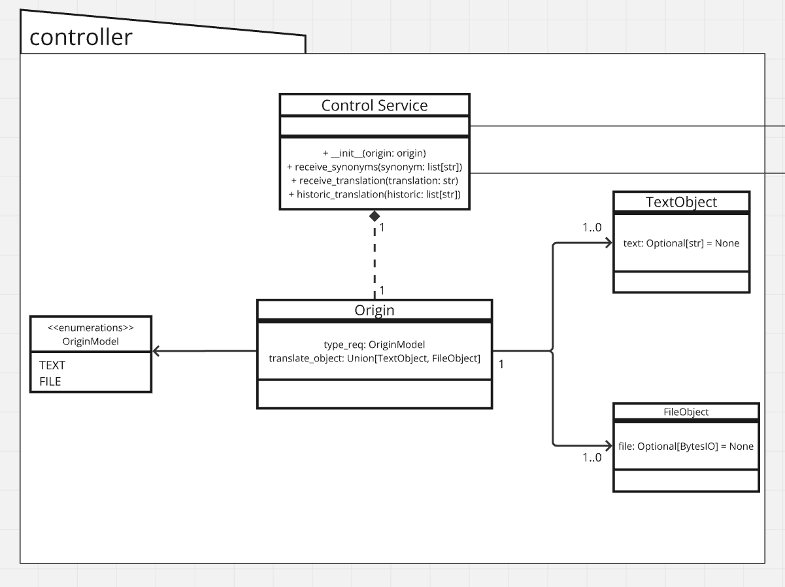

# 3. Desenho de Software (Padrões de Projeto)

## GRASP
GRASP (General Responsibility Assignment Software Patterns) é um conjunto de diretrizes desenvolvido para ajudar na atribuição de responsabilidades a classes e objetos em projetos de software orientado a objetos. Criado por Craig Larman, GRASP consiste em nove padrões que visam promover boas práticas de design, resultando em sistemas de software que são mais robustos, coesos e fáceis de manter.

O papel do GRASP na arquitetura de software é fornecer uma estrutura sistemática para a distribuição de responsabilidades e a organização das interações entre classes e objetos. Ao seguir esses padrões, os desenvolvedores podem criar sistemas com uma arquitetura bem definida, onde as responsabilidades são claramente delineadas e a lógica de negócios está devidamente encapsulada. Isso facilita a manutenção, evolução e extensibilidade do software, reduzindo o risco de problemas comuns como alta complexidade e acoplamento excessivo.

### Os nove padrões GRASP incluem:
- Criador: Ajuda a determinar que classe deve ser responsável por criar instâncias de outra classe.
- Expert de informação: Sugere designar uma responsabilidade para a classe que possui as informações mais relevantes para satisfazê-la.
- Baixo Acoplamento: Busca reduzir as dependências entre classes, minimizando suas interações.
- Alta Coesão: Recomenda agrupar responsabilidades que são relacionadas e tem forte relação semântica em uma única classe.
- Controlador: Sugere introduzir uma classe centralizada, responsável por gerenciar e coordenar o fluxo de informações e ações entre objetos.
- Polimorfismo: Utiliza do polimorfismo para designar responsabilidades baseadas em diferentes tipos ou classes.
- Indireção: Introduz uma classe intermediária para desacoplar duas classes que tem um forte dependência entre si.
- Fabricação pura: Envolve designar uma responsabilidade para uma classe que não possui naturalmente as informações necessárias para satisfazê-la, mas pode fazê-lo sem ferir os princípios de alta coesão e baixo acoplamento.
- Variação protegida: Foca em identificar e encapsular áreas de potencial variação dentro de um sistema para protegê-lo do impacto de mudanças futuras.

#### Desses padrões existentes, optamos por utilizar o GRASP Controller.

## GRASP Controller
O padrão GRASP Controller sendo um dos nove princípios de GRASP que define como gerenciar a entrada do usuário e coordenar a interação entre os objetos no sistema é responsável por lidar com eventos, como cliques de botões, envio de formulários ou outros tipos de interação do usuário. A função principal do Controller é atuar como um intermediário entre a View (interface do usuário) e o Model (lógica de negócios e dados), garantindo que a lógica de apresentação esteja separada da lógica de negócios.

A responsabilidade do Controller é receber a entrada do usuário, processar essa entrada (possivelmente aplicando lógica de negócios) e interagir com o Model para atualizar o estado da aplicação. Em seguida, o Controller atualiza a View para refletir qualquer mudança de estado no Model. Isso promove uma clara separação de preocupações, onde a View se concentra na apresentação e o Model na lógica de negócios, enquanto o Controller coordena a interação entre os dois.

## Diagrama 

Nesta implementação, a classe ControlService é responsável por receber uma entrada da View. A partir dessa entrada, é gerada uma instância da classe Origin, que utilizará as classes TextObject e FileObject para verificar o tipo de entrada, podendo ser texto ou arquivo. Após a análise da entrada, serão feitas requisições aos métodos da camada Model, que é responsável por realizar as requisições à API.



## Implementação

```python
from typing import Union, Optional
from io import BytesIO
import enum
import traceback
import logging as log

log.basicConfig(level=logging.INFO)

class TextObject:
    def __init__(self, text: str):
        self.text = text

class FileObject:
    def __init__(self, file: BytesIO):
        self.file = file

class OriginModel(enum.Enum):
    TEXT: str = 'text'
    FILE: str = 'file'

class Origin:
    def __init__(self, type_req: OriginModel, translate_object: Union[TextObject, FileObject]):
        self.type_req = type_req
        self.translate_object = translate_object

class ControlService:
	def __init__(self, origin: Origin):
		self.deepl_service = DeeplService(origin)  # Serviço de tradução
		self.chat_service = ChatService(origin)  # Serviço para buscar os sinônimos
		self.historic_service = HistoricService(origin)  # Busca de histórico
	
	@staticmethod
	def receive_synonyms(synonym: str) -> list[str]:
		pass # implementar depois
	
	@staticmethod
	def receive_translation(translation: str) -> dict[str, str]:
		pass # implementar depois
	
    @staticmethod
	def historic_translation(historic: list[str]) -> list[str]:
		pass # implementar depois


def main():
    '''
    Exemplo de uso
    '''
    # caso 1 - objeto do tipo texto
    text_obj = TextObject('exemplo de frase para traduzir')
    origin = Origin(OriginModel.TEXT, text_obj)
    control_service = ControlService(origin)

    # caso 2 - objeto do tipo arquivo
    file_bytes = BytesIO(b"") # bytes do arquivo
    file_obj = FileObject(file_bytes)
    origin = Origin(OriginModel.FILE, file_obj)
    control_service = ControlService(origin)

if __name__ == '__main__':
    try:
        main()
    except Exception as generic:
        log.info(f'Erro na main {generic}')
        log.info(f'Traceback: {traceback.format_exc()}')

```

## Ata de reunião de planejamento
- [Ata da reunião](https://docs.google.com/document/d/1iKNSbHj1ppZr3wJ5f9vVvYRNOn8f7xe_Xi8SCo0JtcA/edit?usp=sharing)

## Histórico de Versão
<center>

| Versão |   Data   |                           Alteração                           |                                        Participantes                                         |
| :----: | :------: |:-------------------------------------------------------------:|:--------------------------------------------------------------------------------------------:|
|  1.0   | 23/07/24 |                     Criação do documento e diagrama                     | [Jefferson Sena](https://github.com/JeffersonSenaa/), [Francisco Mizael](https://github.com/frmiza/), [Pedro Campos](https://github.com/pedrocampos0/) |
|  1.1   | 25/07/24 |                     Adição dos padrões GRASP existentes e exemplo de implementação                 | [Pedro Campos](https://github.com/pedrocampos0/), [Daniel Oda](https://github.com/danieloda/) |
|  1.2   | 25/07/24 |                     Refinamento Código Exemplo                | [Daniel Oda](https://github.com/danieloda/), [Pedro Campos](https://github.com/pedrocampos0), [Jefferson Sena](https://github.com/JeffersonSenaa/),  [Francisco Mizael ](https://github.com/frmiza), [Gabriel Barbosa](https://github.com/gabrie1barbosa), [Juan Pablo ](https://github.com/Juan-Ricarte), [Tiago Albuquerque](https://github.com/Tiago1604), [Pedro Torreão](https://github.com/PedroTorreao21), [Pedro Eduardo](https://github.com/PedroEduardoSS) |

</center>