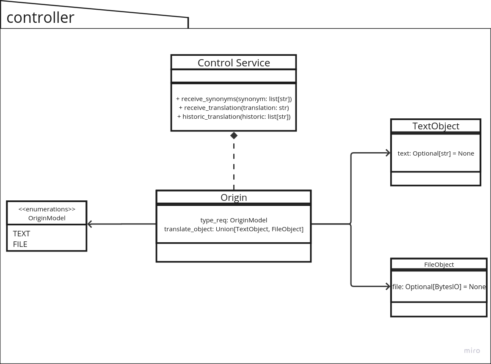

# 3. Desenho de Software (Padrões de Projeto)

## GRASP
GRASP (General Responsibility Assignment Software Patterns) é um conjunto de diretrizes desenvolvido para ajudar na atribuição de responsabilidades a classes e objetos em projetos de software orientado a objetos. Criado por Craig Larman, GRASP consiste em nove padrões que visam promover boas práticas de design, resultando em sistemas de software que são mais robustos, coesos e fáceis de manter.

O papel do GRASP na arquitetura de software é fornecer uma estrutura sistemática para a distribuição de responsabilidades e a organização das interações entre classes e objetos. Ao seguir esses padrões, os desenvolvedores podem criar sistemas com uma arquitetura bem definida, onde as responsabilidades são claramente delineadas e a lógica de negócios está devidamente encapsulada. Isso facilita a manutenção, evolução e extensibilidade do software, reduzindo o risco de problemas comuns como alta complexidade e acoplamento excessivo.

Os nove padrões GRASP incluem: Information Expert, Creator, Controller, Low Coupling, High Cohesion, Polymorphism, Pure Fabrication, Indirection, e Protected Variations. Cada um desses padrões aborda um aspecto específico da atribuição de responsabilidades e oferece diretrizes práticas para resolver problemas recorrentes no design de software.

Segue abaixo os padrões GRASP utilizados no projeto

## GRASP Controller
O padrão GRASP Controller sendo um dos nove princípios de GRASP que define como gerenciar a entrada do usuário e coordenar a interação entre os objetos no sistema é responsável por lidar com eventos, como cliques de botões, envio de formulários ou outros tipos de interação do usuário. A função principal do Controller é atuar como um intermediário entre a View (interface do usuário) e o Model (lógica de negócios e dados), garantindo que a lógica de apresentação esteja separada da lógica de negócios.

A responsabilidade do Controller é receber a entrada do usuário, processar essa entrada (possivelmente aplicando lógica de negócios) e interagir com o Model para atualizar o estado da aplicação. Em seguida, o Controller atualiza a View para refletir qualquer mudança de estado no Model. Isso promove uma clara separação de preocupações, onde a View se concentra na apresentação e o Model na lógica de negócios, enquanto o Controller coordena a interação entre os dois.

## Diagrama 

## Apresentação

## Histórico de Versão

| Versão |   Data   |                           Alteração                           |                                        Participantes                                         |
| :----: | :------: |:-------------------------------------------------------------:|:--------------------------------------------------------------------------------------------:|
|  1.0   | 23/07/24 |                     Criação do documento e diagrama                     |                                            [Jefferson Sena](https://github.com/JeffersonSenaa/), [Francisco Mizael](https://github.com/frmiza/) |

