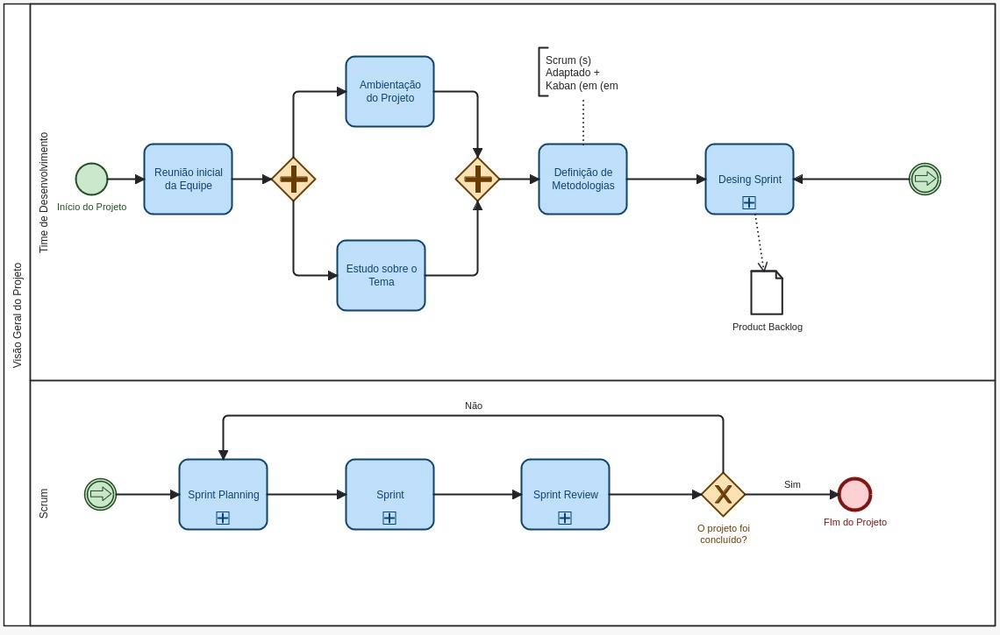

# My Translator

**Código da Disciplina**: FGA0208 
**Número do Grupo**: 09 

## Alunos
|Matrícula | Aluno |
| -- | -- |
| 190127708  |  Daniel Ashton Oda |
| 18011332  |  Francisco Mizael Santos da Silva |
| 200049020  |  Gabriel Barbosa Alencar |
| 200020323  |  Jefferson Sena Oliveira |
| 211041043  |  Juan Pablo Ricarte de Barros  |
| 211031744  |  Júlio César Costa |
| 211031403  |  Marcus Vinicius Cunha Dantas |
| 200059904  |  Pedro Campos Borges |
| 211062375  |  Pedro Eduardo Santos Sousa |
| 190036761  |  Pedro Victor Lima Torreão |
| 190019492  |  Renato Gabriel Moreira Carvalho |
| 202028973  |  Tiago Albuquerque de Lima |
| 190020521  |  Valderson Pontes da Silva Junior |

## Sobre 
Esse projeto visa recriar um tradutor online como o linguee e o Google Tradutor

## Screenshots Primeira Entrega <<FOCO: DSW(Base)>>

  <figure>
    <figcaption>Figura 1: Diagrama da Visão Geral</figcaption>
  </figure>

  <figure>
    <figcaption>Figura 2: Diagrama do Design Sprint</figcaption>
  </figure>

## Screenshots Segunda Entrega <<FOCO: DSW(Modelagem)>>

  <figure>
    <figcaption>Figura 1: Diagrama de Pacotes</figcaption>
  </figure>

  <figure>
    <figcaption>Figura 2: Diagrama de Componentes</figcaption>
  </figure>

  <figure>
    <figcaption>Figura 3: Diagrama de Atividades</figcaption>
  </figure>

## Screenshots Terceira Entrega <<FOCO: DSW(Padrões de Projeto)>>
Adicione 2 ou mais screenshots em termos de artefatos da Terceira Entrega.

## Screenshots Quarta Entrega (FINAL) <<FOCOS: Arquitetura & Reutilização de Software & PROJETO FINAL>>
Adicione 2 ou mais screenshots em termos de artefatos da Quarta Entrega.

## Descritivo dos Principais Aspectos Técnicos 
**Principal(is) Metodologia(s) Adotada(s)**: xxxxxx 
**Principais Linguagens Utilizadas e/ou Pretendidas**: xxxxxx 
**Principais Tecnologias Utilizadas e/ou Pretendidas**: xxxxxx 
**Principal(is) Estilo(s) Arquitetural(is) Adotado(s)**: xxxxxx 

## Há algo a ser executado?

( ) SIM

( ) NÃO

Se SIM, insira um manual (ou um script) para auxiliar ainda mais os interessados na execução.

## Informações Complementares 
Quaisquer outras informações adicionais podem ser descritas nessa seção.
