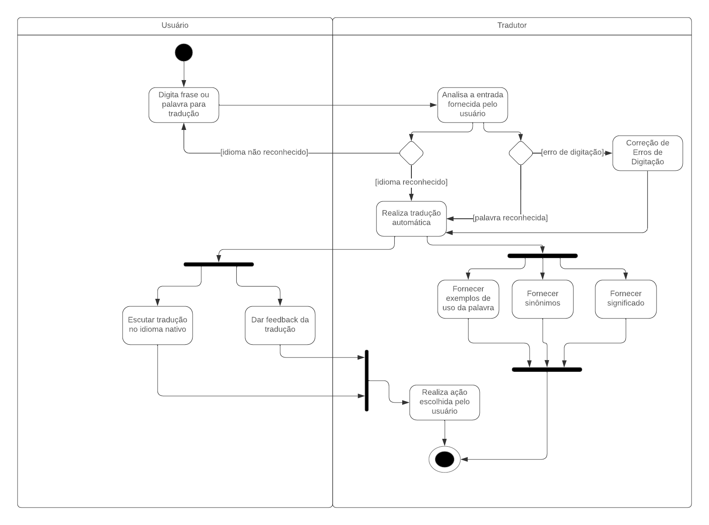

# My Translator

**Código da Disciplina**: FGA0208<br>
**Número do Grupo**: 09<br>

## Alunos
|Matrícula | Aluno |
| -- | -- |
| 190127708  |  Daniel Ashton Oda |
| 18011332  |  Francisco Mizael Santos da Silva |
| 200049020  |  Gabriel Barbosa Alencar |
| 200020323  |  Jefferson Sena Oliveira |
| 211041043  |  Juan Pablo Ricarte de Barros  |
| 211031744  |  Júlio César Costa |
| 211031403  |  Marcus Vinicius Cunha Dantas |
| 200059904  |  Pedro Campos Borges |
| 211062375  |  Pedro Eduardo Santos Sousa |
| 190036761  |  Pedro Victor Lima Torreão |
| 190019492  |  Renato Gabriel Moreira Carvalho |
| 202028973  |  Tiago Albuquerque de Lima |
| 190020521  |  Valderson Pontes da Silva Junior |

## Sobre 
Esse projeto visa recriar um tradutor online como o linguee e o Google Tradutor

## Screenshots Primeira Entrega <<FOCO: DSW(Base)>>
<center>
  <figure>
    <figcaption>Figura 1: Diagrama da Visão Geral</figcaption>
  </figure>
</center>


<center>
  <figure>
    <figcaption>Figura 2: Diagrama do Design Sprint</figcaption>
  </figure>
</center>


## Screenshots Segunda Entrega <<FOCO: DSW(Modelagem)>>
<center>
  <figure>
    <figcaption>Figura 1: Diagrama de Pacotes</figcaption>
  </figure>
</center>


<center>
  <figure>
    <figcaption>Figura 2: Diagrama de Componentes</figcaption>
  </figure>
</center>


<center>
  <figure>
    <figcaption>Figura 3: Diagrama de Atividades</figcaption>
  </figure>
</center>


## Arquitetura & Reutilização de Software & PROJETO FINAL
[Vídeo de Apresentação com o MVP do Projeto Final](https://youtu.be/F3ZZFLypR-8)

## Há algo a ser executado?

(X) SIM

( ) NÃO

Manual de execução (precisa ter o [python](https://www.python.org) e o [npm](https://www.npmjs.com) instalados em sua máquina):
1. Clone o repositório
2. Para executar o frontend, execute os seguintes comandos:
```shell
cd frontend
cd my-translator
npm install
npm run dev
```
3. Para executar o backend, execute os seguintes comandos:
```shell
cd backend
pip install -r requirements.txt
py main.py
```
